# GC97 ESP8266

[English version](README_EN.md)

Прошивка для ESP8266, которая превращает кулонометр GC97 в сетевое устройство: веб-интерфейс, JSON API, MQTT и интеграция с Home Assistant.

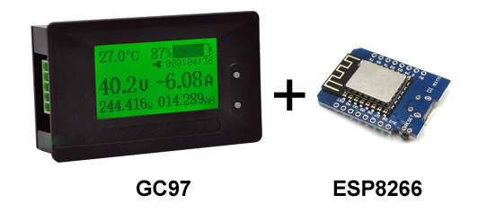

[Скачать готовую прошивку](bin/GC97_ESP.bin)

## Последние изменения

### 260706

- добавлены веб-логи контроллера;

### 260705

- оптимизация кода и проверок соединений;
- исправления работы веб-сервера при крупных и частых ответах;
- улучшение мобильного отображения веб-интерфейса;
- возврат к более стабильной TCP-логике без принудительного сброса соединений.

### 250805

- попытка улучшить отзывчивость веб-сервера контролем TCP-соединений.

### 241012

- косметические изменения;
- эксперимент с `Transfer-Encoding: chunked`.

Архив старых бинарников находится в [bin/previous](bin/previous/).

## Возможности

- чтение данных GC97 по TTL UART;
- веб-интерфейс с текущими показаниями, настройками, перезагрузкой и OTA-обновлением;
- режим точки доступа для первой настройки или аварийного доступа;
- подключение к домашней Wi-Fi сети 2.4 GHz;
- mDNS и SSDP для поиска устройства в локальной сети;
- отправка данных в MQTT;
- Home Assistant MQTT Discovery;
- JSON API для прямого чтения данных;
- световая индикация состояния.

Прошивка рассчитана на платы ESP8266, например Wemos D1 mini, NodeMCU и совместимые. ESP32 пока не поддерживается.

## Подключение

GC97 подключается к ESP8266 через UART. Скорость обмена: `19200`.

Минимальная схема:

| GC97 | ESP8266 |
| --- | --- |
| TX | RX / GPIO3 |
| RX | TX / GPIO1 |
| GND | GND |

Если данные не появляются, сначала попробуйте поменять RX и TX местами. Общая земля обязательна.

ESP8266 работает с логическими уровнями 3.3 В. Если UART-выход GC97 имеет уровень 5 В, лучше поставить согласование уровня или простой делитель напряжения на линии `GC97 TX -> ESP RX`.

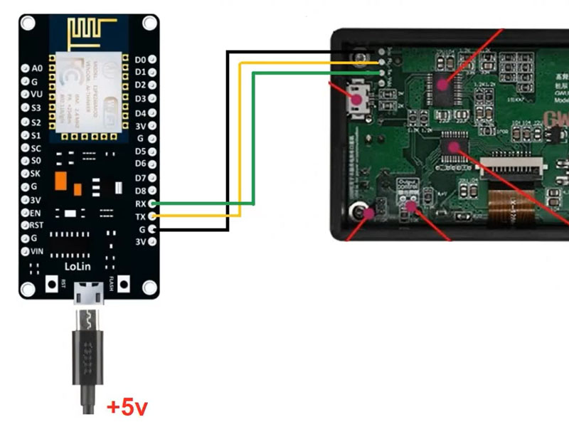

Точки подключения на GC97:

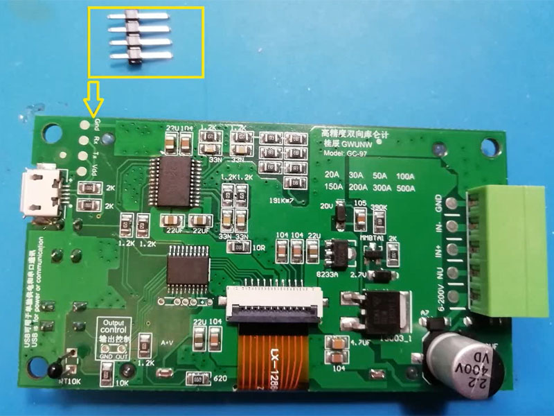

Питание ESP можно подать через USB, через вход 5 В/VIN вашей платы или через стабильный 3.3 В источник, если плата это допускает. Ориентируйтесь на схему конкретной ESP8266-платы.

## Первый запуск

1. Прошейте `bin/GC97_ESP.bin` на ESP8266 по адресу `0x000000`.
2. Перезагрузите плату.
3. Подключитесь к открытой Wi-Fi сети вида `GC97-XXXXXX`.
4. Откройте `http://192.168.4.1`.
5. Зайдите в `Settings` и укажите параметры домашней Wi-Fi сети.
6. Сохраните настройки и перезагрузите ESP.
7. Откройте устройство по адресу, который оно получило от DHCP роутера.

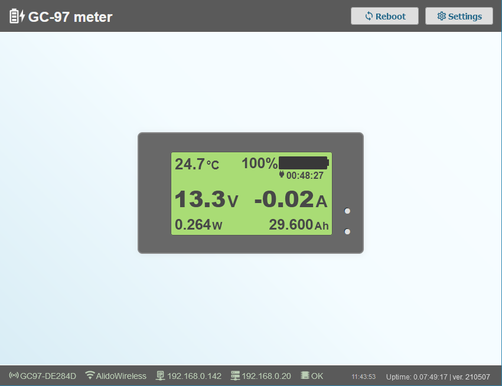

## Настройки

В веб-интерфейсе доступны:

- настройки Wi-Fi и резервной точки доступа;
- сканирование доступных сетей;
- настройки MQTT-брокера;
- период опроса GC97;
- отправка MQTT только при изменении данных;
- включение Home Assistant Discovery;
- включение OTA;
- режим встроенного светодиода.

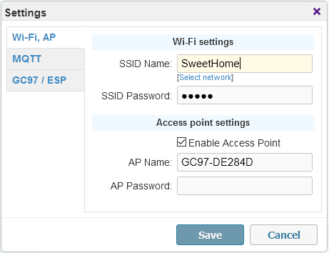

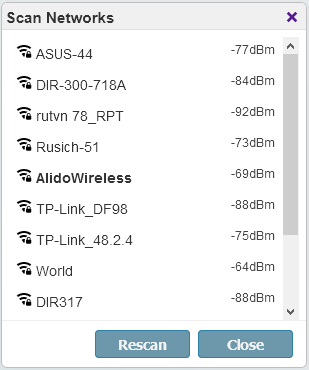

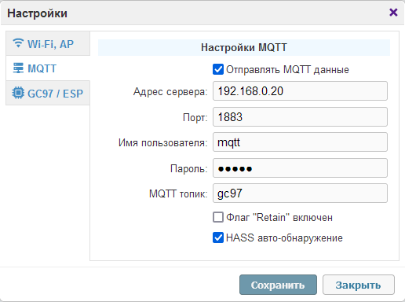

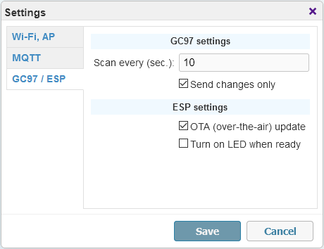

## MQTT

По умолчанию базовый MQTT-топик: `gc97`.

Основные топики:

- `gc97/meter_json` - данные кулонометра;
- `gc97/esp_json` - состояние ESP и сетевые параметры;
- `gc97/state_json` - краткое состояние устройства;
- `gc97/command` - команды управления;
- `gc97/option/ask_timeout` - изменение периода опроса.

Для перезагрузки через MQTT отправьте `restart` в топик `gc97/command`.

Если включить Home Assistant Discovery, устройство автоматически создаст сущности для GC97 и ESP.

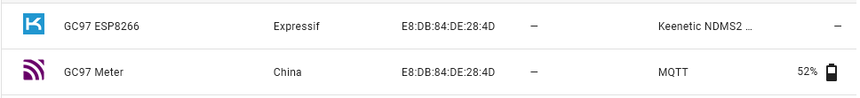

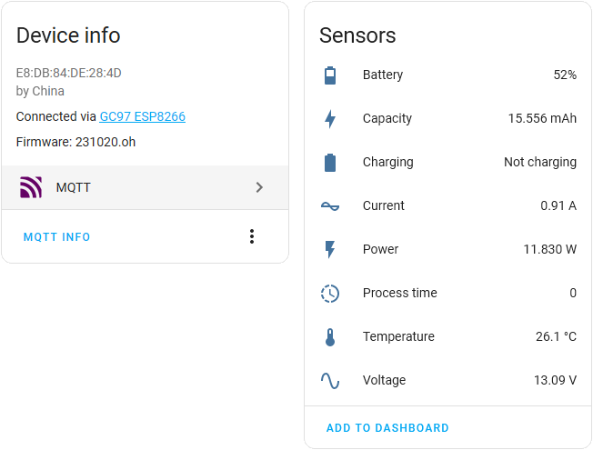

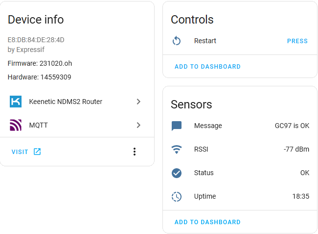

## JSON API

Данные можно получать обычными HTTP-запросами:

- `http://<ip>/get/all.json` - полный пакет данных;
- `http://<ip>/get/gc97.json` - данные GC97;
- `http://<ip>/get/esp.json` - состояние ESP;
- `http://<ip>/get/state.json` - краткий статус;
- `http://<ip>/get/device.json` - описание устройства;
- `http://<ip>/get/logs.json` - логи работы контроллера.

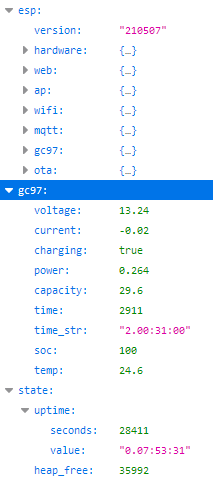

## OTA обновление

Если устройство уже подключено к Wi-Fi и OTA включено в настройках, прошивку можно обновить через веб-интерфейс кнопкой `Upgrade`.

Также можно отправить файл командой:

```bash
curl -F "image=@GC97_ESP.bin" http://<ip>/update
```

После обновления устройство перезагрузится. Настройки должны сохраняться, если используется тот же layout flash-памяти.

## LED индикация

При старте ESP мигает короткой серией. Во время работы индикация повторяется примерно раз в 30 секунд:

- 1 вспышка - нормальная работа;
- 2 вспышки - проблема Wi-Fi;
- 3 вспышки - проблема MQTT;
- 4 вспышки - нет корректных данных от GC97.

Опция `Turn on LED when ready` меняет поведение встроенного светодиода в рабочем режиме на обратный.

## Сервисные команды

- `http://<ip>/cmd/reset` - перезагрузка ESP;
- `http://<ip>/cmd/factory` - сброс настроек к заводским.

Сброс настроек удалит сохраненные Wi-Fi/MQTT параметры. После этого устройство снова поднимет точку доступа `GC97-XXXXXX`.

## Поиск устройства в сети

После подключения к домашней Wi-Fi сети устройство можно найти:

- по IP-адресу из DHCP-таблицы роутера;
- через сетевое окружение Windows, если SSDP работает в вашей сети;
- по mDNS-имени вида `GC97-XXXXXX.local`, если mDNS поддерживается вашей системой.

Если включена опция, точка доступа автоматически отключится через 5 минут после успешного подключения к сети WiFi.
Интерфейс также адаптирован к использованию на мобильных устройствах.

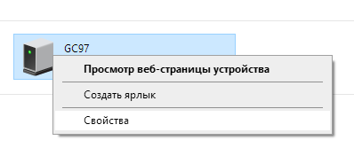

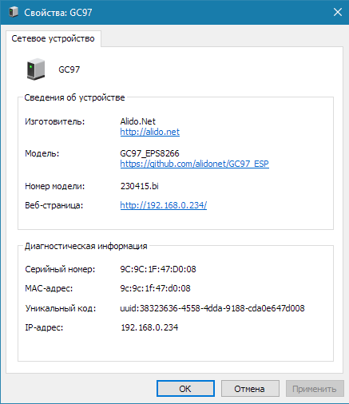

## Известные особенности

- GC97 и ESP должны иметь общую землю.
- ESP8266 чувствителен к качеству питания, особенно при Wi-Fi передаче.
- Если OTA отключена или устройство не подключено к Wi-Fi, удаленное обновление через `/update` будет недоступно.
- При ошибочных Wi-Fi настройках устройство должно поднять собственную точку доступа для восстановления конфигурации.

## Обратная связь

Если нашли ошибку или хотите предложить улучшение, создайте issue в репозитории проекта.
