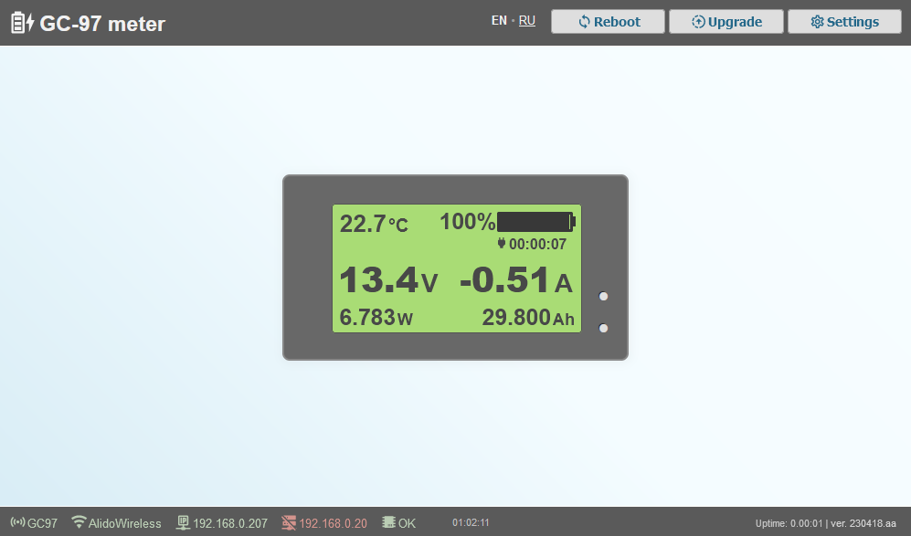
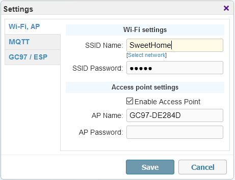
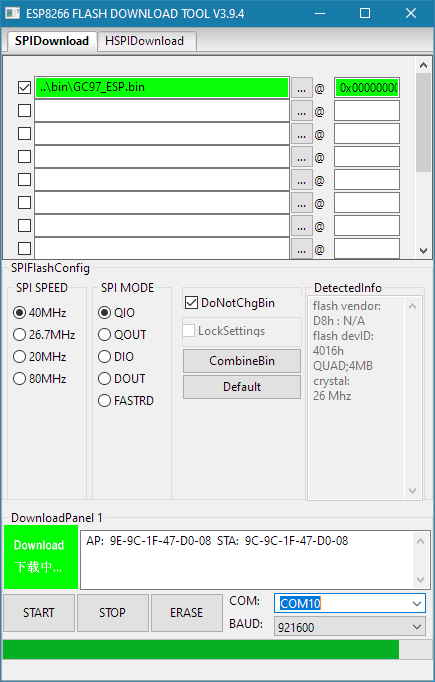
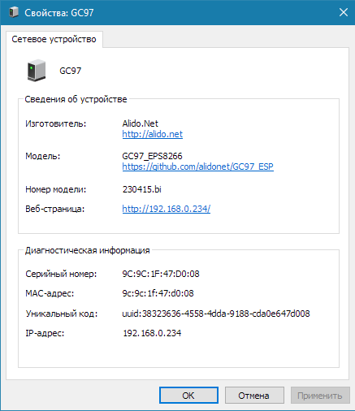

# Обмен данными кулонометра GC97 через микроконтроллер ESP8266
### Удаленный мониторинг заряда/разряда/емкости батареи с поддержкой настроек через веб-интерфейс и отправкой данных по MQTT-протоколу

Кратко о GC97

[Кулонометр GC97](https://aliexpress.ru/wholesale?catId=0&SearchText=GC97%20coulometer) -- простое, китайское изделие, предназначенное для подключения к перезаряжаемой батарее (ИБП, устройства на электропитании от Li-Ion, LeFePo4 и т.п. батарей). Позволяет наглядно отслеживать основные характеристики, такие как напряжение, потребляемый ток (мощность), уровень заряда, остаточную емкость и т.п. Имеет возможность настрйки для разных батарей с указанием отдельных параметров и возможностью точных корректирок. Доступен выход "аварийного" сигнала с извещением, например, о критическом разряде или превышении допустимой мощности нагрузки. Но основная прелесть данного кулонометра -- поддержка TTL протокола. Т.е. с устройства можно снимать показания в цифровом виде, что замечательно подходит для разных систем, которые должны мониториться удаленно или быть в составе модного нынче "умного дома". Одним из простых, дешевых и быстрых решений является использование микроконтроллеров на базе [ESP8266 и производных от него](https://aliexpress.ru/wholesale?CatId=0&SearchText=ESP8266+wifi&ltype=wholesale&SortType=total_tranpro_desc&groupsort=1). Это позволяет удаленно снимать показания с кулонометра через запросы по локальной сети (веб-интерфейс) или же интегрировать это с системой умного дома посредством MQTT протокола. 

 Для создания такой связки Вам необходимо иметь:
 - кулонометр GC97
 - ESP8266 контроллер (в любом виде, доступном вам, от отладочных версий NodeMCU до миниатюрных D1 mini и т.п.)
 - обеспечить питание контроллера ESP (питание можно подавать через порт USB, если таковой имеется, с отдельного источника питания, внешнего или миниатюрного понижающего DC-DC преобразователя; Предпочтительно иметь общую землю с батареей/кулонометром, главное – следите, чтобы подавать разрешенные  3.3 или 5В).

 Подключаете GC97 к батарее согласно приведенной на нем схеме и обеспечиваете питание ESP. Сам GC97 имеет выводы Rx/Tx, которые необходимо подключить к соответствующим выводам ESP (если сразу не заработает, пробуйте поменять местами Rx/Tx). Вполне легко плата ESP (и миниатюрный DC-DC прячутся внутри корпуса GC97 – там достаточно места).
 
 Обзоры, примеры использования и подключения вы можете найти в Youtubе, например на канале [dima espirans](https://www.youtube.com/watch?v=-X8CvknmFzM).

---

[**Скачать прошивку**](bin/)

---

## Последние изменения:

- [*240612*](bin/)
  - исправлено возможное зависание при обрыве соединения в момент передачи большого пакета данных;
  - изменения в части подключения клиентов к точке дсотупа;
  - добавлена опция авто-отключения точки доступа через 3-5 минут после подключения к WiFi для освобождения эфира;
  - улучшен контроль соединения с WiFi, форсированное авто-подключение;
  - автоматический запуск точки доступа при проблемах с WiFi подключением (даже если опция отключена в настройках);
  - небольшие правки в UI;
  - исправлено MQTT описание сенсора емкости батареи (кейс #12);
  - больше технических данных в json состояния;

- [*240504*](bin/previous/240504/)
  - очередная попытка исправить работу веб-сервера (обрыв при передаче данных, неполная загрузка - кейс #7);
  - исправлено MQTT описание сенсора емкости батареи (кейс #12);

- [*240317*](bin/previous/240317)
  - попытка исправить работу веб-сервера (обрыв при передаче данных, неполная загрузка - кейс #7);
  - небольшая оптимизация веб-контента: убраны украшательства в виде иконок статуса, минификация стилей и скриптов, возврат к одностраничному кешированному документу;
  - авто-перезагрузка страницы при обнаружении новой версии для обновления кеша;
  - небольшие исправления на перезагрузку контроллера (веб интерфейс);
  - небольшая оптимизация подключения к MQTT, повторные попытки подключения в случае потери связи (в течение пары минут, кейс #8);
  - небольшие изменения в декларировании сенсоров в режиме Hass Discovery (кейс #9);
  - обычный режим отдачи данных по MQTT: отдельные сенсоры + общие json;

- [*231130*](bin/previous/231130/)
  - исправлена ошибка с отображением отрицательных температур (#5);
  - MQTT-сервер можно указать как обычный веб-адрес (было разрешено только как IP-адрес до этого момента);
  - небольшая оптимизация подключения к MQTT, повторные попытки подключения в случае неудач (с интервалом от пары минут);

- [*231023*](bin/previous/231023/)
  - небольшая оптимизация работы веб-сервера, исправлно кеширование статичных страниц;
  - HASS Discovery: изменены названия топиков, добавлена опция частоты опроса;

- [*231020*](bin/previous/231020/)
  - добавлена опция HASS Discovery;
  - изменения в UI странице: разбивка на html, css, js (все части кешируются), что позволяет немного улучшить отзывчивость;

- [*230526*](bin/previous/230526/)
  - исправлена форма настроек (было ограничение длины полей 16 символов, кейс #4);
  - авто-включение точки доступа, если не удалось соединиться с wifi сетью;
  - исправлено падение при вызове mDNS, когда некорректно инициализированы сетевые протоколы (нет корректных настроек);

- [*230420*](bin/previous/230420/)
  - Оптимизированный вариант прошивки в виде одного файла: не требует наличия SPIFFS, упрощенная первичная прошивка и обновление;
  - Мелкие исправления в работе веб-сервера;

- [*230418*](bin/previous/230418/)
  - Адаптация UI для мобильных устройств, небольшие правки веб страницы настроек;
  - Ссылки на актуальные файлы прошивок в диалоге обновления;
  - Исправлена ошибка с обновлением прошивки/файловой системы через диалог (#1);
  - Добавлена версия для прошивки одним файлом;

- [*230417*](bin/previous/230418/)
  - Добавлена поддержка мульти-язычного UI, доступные языки: English, Русский;
  - Исправлены ошибки в UI с диалогами, сохранением пустых настроек;
  - Новый способ буферизированной отдачи файлов веб-сервером;

- [*230415*](bin/previous/230415/)
  - Добавлена поддержка SSDP (обнаруживается в сети как устройство GC97);
  - Исправлено возможные падение/перезагрузка контроллера при отсутствии соединения с WiFi;
  - Исправления на основной веб-странице;
  - Расширенный блок настроек (увеличены текстовые поля для адресов, имен и т.п., #3);

---

Итак, здесь вы найдете прошивку ESP8266 для работы с кулонометром GC97, которую я создал для личных нужд. Это моя первая прошивка ESP и опыт такого плана, так что могут быть какие-то ошибки и недочеты. Но уж что есть :)

*В прошивке доступны следующие возможности*:
- AP (wifi точка доступа) -- для независимой работы и первоначальной настройки. По-умолчанию создается открытая (без пароля) сеть с именем GC97-XXXX (где XXXX -- последние знаки mac-адреса ESP), IP адрес 192.168.4.1;
- Подключение к WiFi сети (возможность просканировать и выбрать сеть 2.4GHz, авто-подключение по таймауту);
- Виртуальный хост локальной сети mDNS (<Имя_точки_AP>.local);
- Поддержка SSDP (устройство видно в локальной сети и можно открыть панель управления просто по клику);
- Встроенный веб-сервер с основной информацией кулонометра, возможностью настройки через веб-интерфейс, перезагрузки, сброса и прошивки; адаптация для отображения на мобильных  устройствах;
- Поддержка OTA (over-the-air) обновлений;
- Поддержка отправки данных через MQTT-брокера с возможностью указания адреса и порта сервера, имени, пароля, топика и поддержка Retain флага; Авто-подключение; Оптимизация отправки данных только на изменения;
- Для Home Assistant доступна опция Discovery: автоматическое добавление устройств и объектов;
- Запрос данных через веб в формате JSON (по типам, общий запрос);
- Выбор периода опроса кулонометра GC97, контроль и усреднение серии данных для сглаживания "выбросов" в значениях;
- Световая индикация состояния ESP/подключений и режима работы;
- Вывод отладочной информации основных действий и состояния контроллера ESP при подключении по серийному порту (скорость подключения 19200).

## Веб-интерфейс

Страница доступна:
- по IP адресу встроенной точки доступа (192.168.4.1, после подключения к сети GC97-XXXX);
- по IP адресу, выданному DHCP сети wifi (если указаны корректные SSID и пароль), например 192.168.0.100;

На данной странице отображается текущее состояние кулонометра и всех подключений (данные обновляются с периодичностью в 10-15 секунд).

### Диалог настроек:

Доступны настройки встроенной точки доступа (AP), (если имя пустое, то будет использовано именование GC97-XXXX, где XXXX последние символы mac-адреса ESP). Также можно задать данные авторизации в сети WiFi (приоритетный, рекомендуемый режим):

Доступно сканирование сетей с возможностью выбора необходимой:

Можно указать необходимые настройки MQTT брокера:

Укажите период опроса кулонометра (не чаще 1 раза в секунду), это же является периодом отправки данных по MQTT-протоколу:

Если включена опция "Оправка только изменений", то запросы на MQTT-брокер будут выполняться только в случае изменений и принудительно 1 раз в 10 циклов опроса (для случаев, когда не используется retain).
Также можно отключить поддержку обновлений по воздуху (OTA, требуется перезагрузка для применения опции).
Опция "Всегда включенный светодиод" инвертирует работу встроенного светодиода на плате ESP: постоянное свечение в режиме работы.

## LED индикация

При загрузке ESP идет серия коротких и частых миганий в течение секунды. Далее, с периодичностью раз 2 секунды одиночные вспышки информируют о попытках подключения к сети WiFi, двойные вспышки -- к серверу MQTT (если указаны параметры того и другого).

С периодичностью опроса кулонометра (по умолчанию раз в 10 секунд) вы мождете видеть вспышки светодиода. Количество означает состояние:
- Одиночная, умеренно продолжительная вспышка -- нормальный режим работы;
- Двойная вспышка говорит о проблеме Wifi подключения;
- Тройная вспышка говорит о проблеме подключения к MQTT-брокеру;
- Четыре вспышки -- невозможно получить данные с кулонометра GC97 (не подключен или данные неверны).

## Данные кулонометра

Вся информацию кулонометра, а также большинство сведений о состоянии ESP и настройки передаются MQTT-брокеру с указанной частотой в виде json. Эти же данные в формате json можно напрямую запросить в любой произвольный момент через постоянный веб-адрес:
- http://<ip_address>/get/all.json --  весь пакет данных
- http://<ip_address>/get/gc97.json -- данные кулонометра
- http://<ip_address>/get/esp.json -- состояние и настройки ESP
- http://<ip_address>/get/state.json -- uptime ESP

## HASS Discovery

Если вы используете GC97 в составе умного дома на базе Home Assistant, то доступна опция HASS Discovery. При ее включении MQTT будет отправлять полные описания всех сенсоров и устройств. В результате, в течение нескольких секунд у вас в списке устройств появится 2 новые записи -- для самого кулонометра и для платы ESP:

При этом поддерживается работа с несколькими устройствами одновременно. Так же вы можете удаленно перезапускать устройство прямо из интерфейса умного дома и отслеживать его текущее состояние.

## Дополнительные команды

Для управления через веб доступны команды:
- http://<ip_address>/cmd/reset -- перезагрузка (доступно через веб-интерфейс);
- http://<ip_address>/cmd/factory -- сброс всех настроек (может быть иногда полезно, но если контроллер еще доступен через веб :), иначе только перепрошивка).

## Прошивка

В теущей версии для корректной работы требуется прошить только основной код. Это можно сделать с помощью любой утилиты для прошивки ESP, через Arduino IDE и т.п. Рекомендую использовать [Flash download tools](https://www.espressif.com/en/support/download/other-tools). 
- **GC97_ESP.bin** -- Основная прошивка с кодом (адрес 0x0000000) -- можно использовать также для OTA обновления;

1. Запустить утилиту для прошивки, указать контроллер ESP8266 и выбираем файл с прошивкой (первая срока):

2. Внизу выбрать COM-порт, к которому подключен контроллер и нажать кнопку "START";
3. После окончания прошивки закрываем утилиту и перезагружаем контроллер; При желании работу контроллера можно отслеживать с помощью любой утилиты мониторинга COM-порта;
4. Находим открытую точку доступа с именем GC97-XXXXXX, где XXXXXX -- последние знаки mac-адреса вашей платы ESP; Подключаемся к этой точке доступа (по умолчанию -- без пароля);
5. Открыть в браузере страницу <http://192.168.4.1>; Должен отобразиться интерфейс -- в верхней строке нажать "Настройки" ("Settings");

6. Указать имя сети и пароль (с учетом регистра) вашей WiFi сети; Сохраните настройки, подождите 15-20 секунд;
7. Перегрузите ESP и дождитесь его появления в сети (может занять до 30 секунд);
8. Откройте <http://192.168.4.1> и убедитесь, что WiFi подключен и контроллер получил IP-адрес в вашей сети (например, 192.168.1.100); Иначе -- проверьте настройки вашей сети (пункт 6);
9. Теперь вы можете отключиться от сети GC97-XXXXXX и открыть полноценный интерфейс по новому адресу, выданному контроллеру в вашей WiFi сети  (например, 192.168.1.100).

Как вариант, если вы используете Windows, можете не выполнять шаги 8-9, а просматривать устройства вашей локальной сети. Обычно это длительный процесс, но так тоже можно узнать адрес контроллера и открыть панель управления просто по клику.
В списке сетевых устройств появится GC97:

Контекстное меню:

Как вариант, если устройство работает нормально и вы хотите обновить прошивку по воздуху (OTA), то это можно сделать из консоли, запустив из папки, где расположен файл прошивки, команду: `curl -F "image=@GC97_ESP.bin" <ip-адрес>/update`, где _<ip-адрес>_ нужно заменить на ваш.

## Старый вариант прошивки (для версий с .spiffs.bin поршивками)

[Смотрите в описании к старым прошивкам](bin/previous/230419/)

## Баги

Вроде критичных нет :)
Создавайте Issues, если найдете :)

## To-Do / Планы
 
В данный момент реализован весь базовый функционал. Возможно, при наличии времени, будут добавлены:
- [x] HASS discovery (поддержка Home Assistant Discovery mode);
- [x] MQTT entities -- режим с отдельными параметрами кулонометра при передаче по MQTT (сейчас только в виде пакета данных формата json);
- [ ] Дополнительные опции в UI (в коде поддержка большинства уже есть) для настройки: отдельных блоков данных, отдаваемых MQTT; некоторые таймауты и периоды проверок/обновлений; детализация вывода Debug в серийный порт (для отладки и контроля процессов), а также удаленный просмотр логов контроллера через веб. 
- [ ] Поддержка Blynk (вроде как многие пользуются);
- [ ] Перевод описания на английский;
- [ ] Видеоинструкция по первоначальной настройке;
- [ ] Что-то еще, сейчас не вспомню :)
