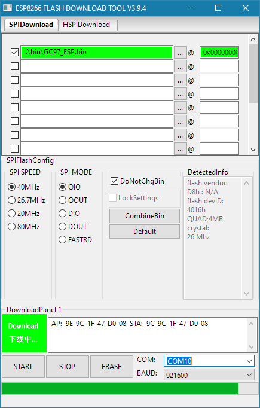
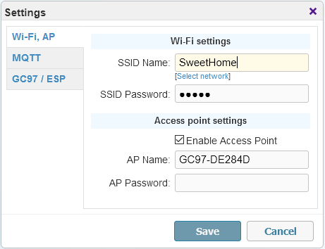
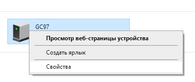

## Прошивка

В теущей версии для корректной работы требуется прошить только основной код. Это можно сделать с помощью любой утилиты для прошивки ESP, через Arduino IDE и т.п. Рекомендую использовать [Flash download tools](../utils/). 
- **GC97_ESP.bin** -- Основная прошивка (адрес 0x0000000) -- можно использовать для первичной прошивки и также для обновления;

1. Запустить утилиту для прошивки, указать контроллер ESP8266 и выбираем файл с прошивкой (первая срока):

2. Внизу выбрать COM-порт, к которому подключен контроллер и нажать кнопку "START";
3. После окончания прошивки закрываем утилиту и перезагружаем контроллер; При желании работу контроллера можно отслеживать с помощью любой утилиты мониторинга COM-порта;
4. Находим открытую точку доступа с именем GC97-XXXXXX, где XXXXXX -- последние знаки mac-адреса вашей платы ESP; Подключаемся к этой точке доступа (по умолчанию -- без пароля);
5. Открыть в браузере страницу <http://192.168.4.1>; Должен отобразиться интерфейс -- в верхней строке нажать "Настройки" ("Settings");

6. Указать имя сети и пароль (с учетом регистра) вашей WiFi сети; Сохраните настройки, подождите 15-20 секунд;
7. Перегрузите ESP и дождитесь его появления в сети (может занять до 30 секунд);
8. Откройте <http://192.168.4.1> и убедитесь, что WiFi подключен и контроллер получил IP-адрес в вашей сети (например, 192.168.1.100); Иначе -- проверьте настройки вашей сети (пункт 6);
9. Теперь вы можете отключиться от сети GC97-XXXXXX и открыть полноценный интерфейс по новому адресу, выданному контроллеру в вашей WiFi сети  (например, 192.168.1.100).

Как вариант, если вы используете Windows, можете не выполнять шаги 8-9, а просматривать устройства вашей локальной сети. Обычно это длительный процесс, но так тоже можно узнать адрес контроллера и открыть панель управления просто по клику.
В списке сетевых устройств появится GC97:

Контекстное меню:

Как вариант, если устройство работает нормально и вы хотите обновить прошивку по воздуху (OTA), то это можно сделать из консоли, запустив из папки, где расположен файл прошивки, команду: `curl -F "image=@GC97_ESP.bin" <ip-адрес>/update`, где _<ip-адрес>_ нужно заменить на ваш.

---

## История изменений

- [*240504*]
  - очередная попытка исправить работу веб-сервера (обрыв при передаче данных, неполная загрузка - кейс #7);
  - исправлено MQTT описание сенсора емкости батареи (кейс #12);

- [*240317*]
  - попытка исправить работу веб-сервера (обрыв при передаче данных, неполная загрузка - кейс #7);
  - небольшая оптимизация веб-контента: убраны украшательства в виде иконок статуса, минификация стилей и скриптов, возврат к одностраничному кешированному документу;
  - авто-перезагрузка страницы при обнаружении новой версии для обновления кеша;
  - небольшие исправления на перезагрузку контроллера (веб интерфейс);
  - небольшая оптимизация подключения к MQTT, повторные попытки подключения в случае потери связи (в течение пары минут, кейс #8);
  - небольшие изменения в декларировании сенсоров в режиме Hass Discovery (кейс #9);
  - обычный режим отдачи данных по MQTT: отдельные сенсоры + общие json;

- [*231130*]
  - исправлена ошибка с отображением отрицательных температур (#5);
  - MQTT-сервер можно указать как обычный веб-адрес (было разрешено только как IP-адрес до этого момента);
  - небольшая оптимизация подключения к MQTT, повторные попытки подключения в случае неудач (с интервалом от пары минут);

- [*231023*]
  - небольшая оптимизация работы веб-сервера, исправлно кеширование статичных страниц;
  - HASS Discovery: изменены названия топиков, добавлена опция частоты опроса;

- [*231020*]
  - добавлена опция HASS Discovery;
  - изменения в UI странице: разбивка на html, css, js (все части кешируются), что позволяет немного улучшить отзывчивость;

- [*230526*]
  - исправлена форма настроек (было ограничение длины полей 16 символов, кейс #4);
  - авто-включение точки доступа, если не удалось соединиться с wifi сетью;
  - исправлено падение при вызове mDNS, когда некорректно инициализированы сетевые протоколы (нет корректных настроек);

- [*230420*]
  - Оптимизированный вариант прошивки в виде одного файла: не требует наличия SPIFFS, упрощенная первичная прошивка и обновление;

- [*230418*]
  - Адаптация UI для мобильных устройств, небольшие правки веб страницы настроек;
  - Ссылки на актуальные файлы прошивок в диалоге обновления;
  - Исправлена ошибка с обновлением прошивки/файловой системы через диалог (#1);
  - Добавлена версия для прошивки одним файлом;

- [*230417*]
  - Добавлена поддержка мульти-язычного UI, доступные языки: English, Русский;
  - Исправлены ошибки в UI с диалогами, сохранением пустых настроек;
  - Новый способ буферизированной отдачи файлов веб-сервером;

- [*230415*]
  - Добавлена поддержка SSDP (обнаруживается в сети как устройство GC97);
  - Исправлено возможные падение/перезагрузка контроллера при отсутствии соединения с WiFi;
  - Исправления на основной веб-странице;
  - Расширенный блок настроек (увеличены текстовые поля для адресов, имен и т.п., #3);

- [*210820*]
  - Исправлены недочеты в упрощенной странице настройки;

- *210514*
  - Добавлена упрощенная страница настройки для случаев, когда нет файловой системы;
  - Небольшие правки в UI;

- *210508*
  - Исправления в UI, обновление прошивки файловой системы;

- *210505*
  - UI: Сохранение настроек из веб, обновления в диалоге сканирования Wifi сетей;

- *210503*
  - Обновления в данных json;

- *210430*
  - UI: Кастомные диалоги, обновление базового интерфейса;

- *210429*
  - UI: Диалог настроек, кнопка перезагрузки;

- *210421*
  - Тестовая версия прошивки.
